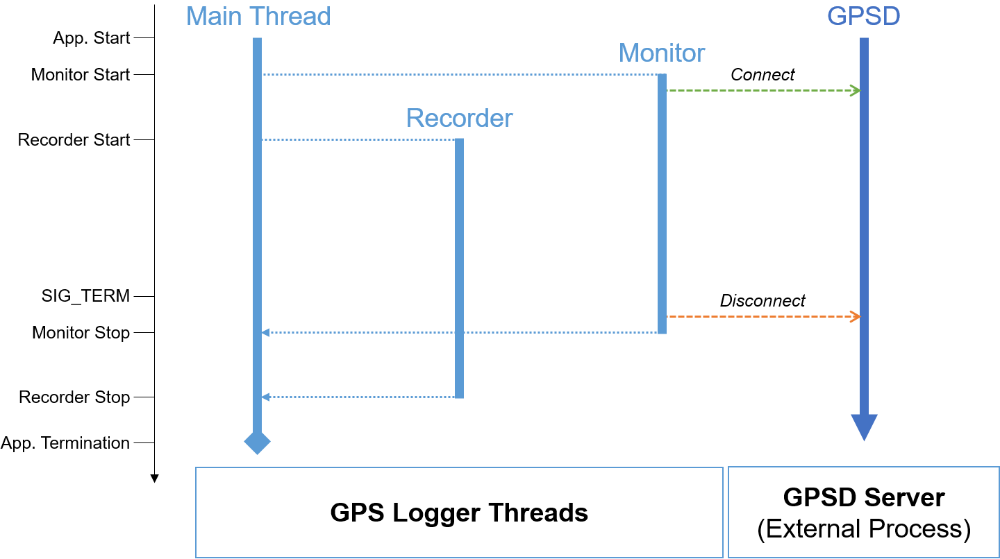
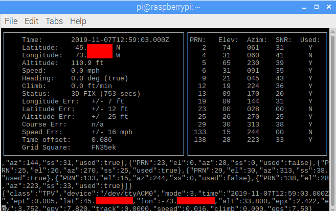

# Project Description

The availability and affordability of GPS receivers enables the access to relatively accurate positionning data. In this project, I developed a real-time GPS data logger. This multi-threaded application allows connecting to a [GPSD server](https://gpsd.gitlab.io/gpsd/index.html), retrieve real-time location data and save it to a local SQLite database. In addition, the stored data can be exported in both [Keyhole Markup Language (KML)](https://developers.google.com/kml) and [GPS Exchange Format (GPX)](https://www.topografix.com/gpx.asp) formats.

## Application Overview

### Features

* Retrieval of location data from a background GPSD server.
* Storage of retrieved data to a local SQLite database (if the database does not exist, it is automatically created).
* Export of location data in both KML and GPX formats.
* Concurrent execution.
* Automatic GPSD configuration.
* Fully-configurable application.
* Automatic database creation and configuration.

### Multithreading

To improve its performance, the application uses three distinct threads to handle the different tasks:

| Thread           | Task           | Remarks  |
| ---------------- |:-------------  | ----- |
| Main thread      | The main application thread. It manages the application configuration as well as the starting and stopping of the other threads.                     |  |
| Monitor thread   | This thead retrieves the location data at regular time intervals and saves it to a synchronized shared queue. | Started and stopped before the Recorder thread   |
| Recorder thread  | This threads retrieves the location data from the shared queue and stores it to the SQLite database at regular time intervals. | Started and stopped after the Monitor thread |

In addition to these threads, the application (especially the Monitor thread) requires an external process (i.e., GPSD server) in order to retrieve location data. If the GPSD process is not already running (and launched with the [appropriate parameters](https://gpsd.gitlab.io/gpsd/gpsd.html)), the Monitor thread stops and the application exits.


*The application launches two distinct threads to seperately handle location data retrieval and storage.*

### Configuration Parameters

What things you need to install the software and how to install them

| Parameter        | Description           | Default Value  |
|:-------------:|:------------- |:-----:|
| gpsd_ip_address      | The GPSD server IP address (or hostname) | 127.0.0.1 |
| gpsd_port     | The GPSD server TCP port |   2947 |
| start_gpsd | A flag indicating if the application should automatically start the GPSD server (This is useful especially if the GPSD service startup is set to manual)  | true |
| enable_new_session | A flag indicating that every time the application starts, it creates a new session | true |
| database_filename | The SQLite database filename and path | gps_logger.db |
| database | The name of the SQLite database | gps_logger |
| session_tablename | The name of the session datatable | session |
| location_tablename | The name of the location datatable      | location |
| monitor_delay | The time interval of the monitor thread | 0.5 |
| recorder_batch_size | The maximum number of data records stored simultaneously in the database | 100 |
| recorder_interval | The time interval of the recorder thread | 5 |

## Prerequisites

These instructions will get you a copy of the project up and running on your local machine for development and testing purposes. See deployment for notes on how to deploy the project on a live system.

### Software Requirements

For both Ubuntu and Raspbian, the following tools should be installed:
* `gpsd` : the GPSD service
* `gpsd-clients` : a [client package for GPSD](https://www.mankier.com/package/gpsd-clients) including *cgps* and *xgps*
* `python-gps` : a GPSD library for Python

```console
sudo apt-get install gpsd gpsd-clients python-gps
```
Other optional software tools for visualizing, dumping and converting GPS data can also be installed. For example, one can install:
* `foxtrotgps` : a [tool](https://www.foxtrotgps.org/) for real-time GPS navigation, track logging and trip planning
* `gpsbabel` : a [tool](https://www.gpsbabel.org/index.html) for GPS data conversion

### Hardware Requirements

Any GPS device that is compatible with the [official GPSD release](https://gpsd.gitlab.io/gpsd/index.html) can be used in conjunction with this code. In this project, I used the **Stratux Vk-162 Remote Mount USB GPS** and it worked as intended.

 \
*Stratux Vk-162 Remote Mount USB GPS. (Photo credit: www.amazon.com)*

## Application Deployment

Explain how to run the automated tests for this system

### GPSD Configuration

Before running the application, the GPSD service should be running. The service can be typically parametrized as follows:

```console
gpsd [-b ] [-D debuglevel] [-F control-socket] [-f framing] [-G ] [-h ] [-l ] [-n ] [-N ] [-P pidfile] [-r ] [-S listener-port] [-s speed] [-V ] [ [source-name] ...]
```
I use this minimalist command to configure and run the GPSD service:

```console
pi@raspberrypi:~ $ sudo gpsd -D 4 -F /var/run/gpsd.sock -P /var/run/gpsd.pid -N -n /dev/ttyAMA0
```
For more information about the GPSD configuration, please refer to the [official documentation](https://gpsd.gitlab.io/gpsd/gpsd.html).

To check that the GPSD is up and running, one can use the command:

```console
pi@raspberrypi:~ $ cgps
```

 \
*Running cgps command is expected to show the current device's location.*

### Running the Application

To run the application, the following steps are recommended:

1. Alter the parameters in the [config.json](./config/config.json) file as desired.
2. Run the command:

```console
pi@raspberrypi:~ $ python3 app.py
```
To stop the application, the key combination `CTRL + C` is enough.

## Built With

* [Python 3.7](https://www.python.org/downloads/)

## Tested With

* [Ubuntu 18.04](http://releases.ubuntu.com/18.04/)
* [Raspbian 10](https://www.raspberrypi.org/downloads/raspbian/)

## License

This project is licensed under the MIT License - see the [LICENSE](LICENSE) file for details.

